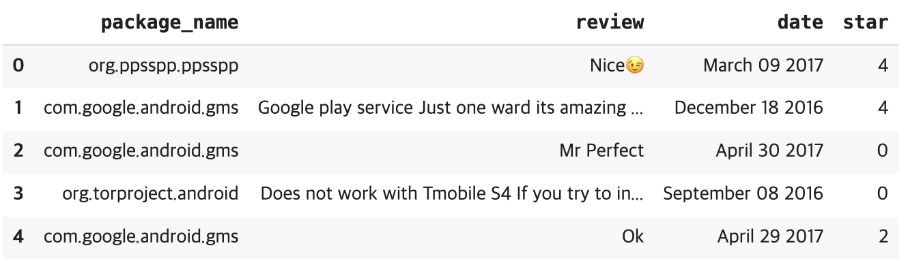
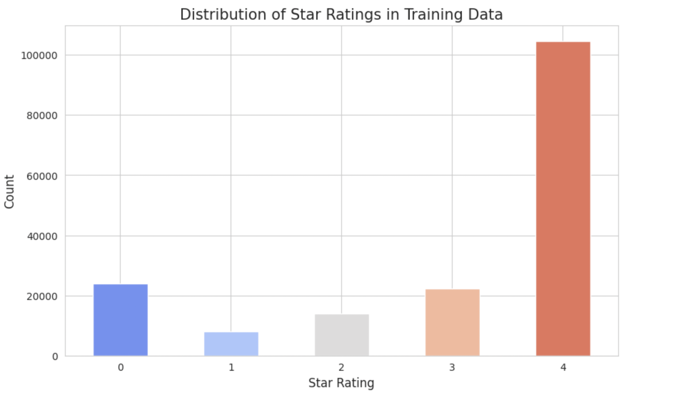
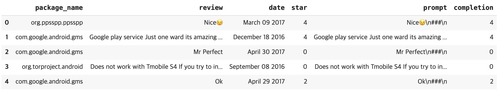
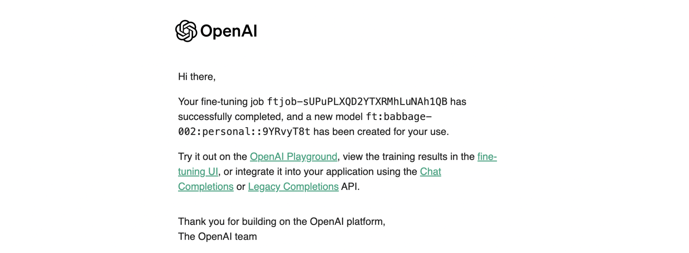
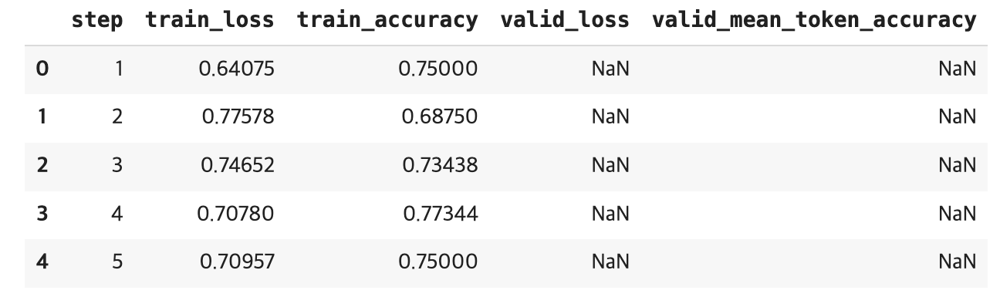
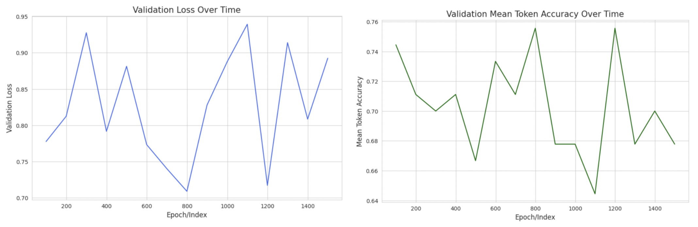
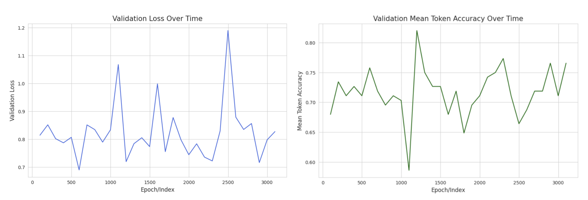
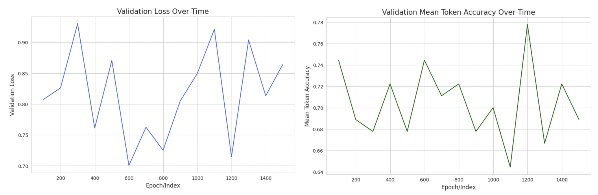
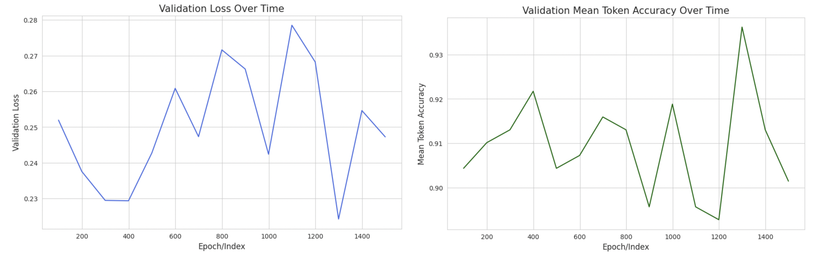
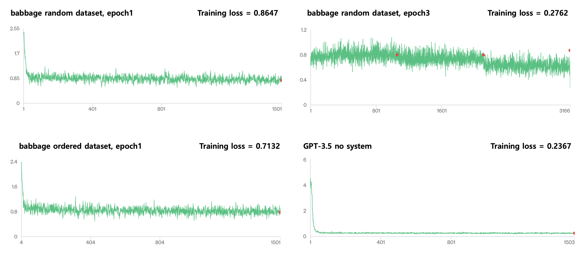

# 맞춤형 파인튜닝(Fine-tuning)으로 LLM을 최적화하기
**파인튜닝**  
파인튜닝은 이미 만들어진 모델을 업데이트해서 더 높은 품질의 결과를 만든다.
- 사용하는 토큰을 절약하고, 더 빠른 답변을 만들 수 있다.
- 장기적으로 비용을 절역하는 데 매우 효과적이다.

## 파인튜닝과 전이학습(Transfer Learning)
파인 튜닝은 전이학습을 기반으로 한다. 

**전이학습**은 사전 훈련된 모델을 활용해 새로운 작업이나 분야에 기존 지식을 적용하는 기술이다.

**파인튜닝**은 사전 훈련된 모델의 파라미터들을 '최종'목표 작업에 더 잘 맞게 조정하는 전이학습의 특별한 형태이다.

### 파인튜닝 과정
1. 레이블이 지정된 데이터 수집
2. 하이퍼파라미터 선택
3. 모델 적응
4. 평가와 반복
5. 모델 구현 및 추가 학습

### 파운데이션 모델로 사전 훈련된 closed 소스 모델 사용
사전 훈련된 LLM은 전이학습과 파인튜닝에서 중요한 역할을 하며, 일반 언어의 이해와 지식의 기초를 제공한다.

**OpenAI의 파인튜닝 인프라를 사용하는 이점**
- 광범위하고 다양한 데이터셋에서 훈련된 GPT-4와 같은 강력한 사전 훈련 모델에 접근할 수 있다.
- 다양한 수준의 전문 지식을 가진 사람들을 위해 파인튜닝 과정을 단순화시킨 비교적 사용자 친화적인 인터페이스가 존재한다.
- 하이퍼파라미터를 선택하는 지침, 맞춤 예시를 준비하는 팁, 모델 평가에 대한 조언 등 파인튜닝 과정을 최적화하는 데 도움이 되는 다양한 도구와 자원이 있다.

</br>

## OpenAI 파인튜닝 API 살펴보기
GPT-3 API는 개발자들에게 진보된 LLM 중 하나에 대한 접근을 제공한다.

### 사례 연구: Amazon 리뷰 감정 분류
amazon_review_multi 데이터셋을 사용하여, 리뷰들에 감정 분류를 수행할 수 있도록 OpenAI의 사전 훈련된 모델을 파인튜닝 한다.
- review_title: 리뷰의 텍스트 제목
- review_body: 리뷰의 텍스트 본문
- starts: 1과 5 사이의 정수로 별점을 나타냄

### 데이터에 대한 지침 및 모범 사례
파인튜닝을 위한 데이터를 선택할 때 고려해야 할 몇 가지 사항
- 데이터 품질
- 데이터 다양성
- 데이터 균형
- 데이터 양

</br>

## OpenAI CLI로 맞춤형 예제 준비
파인튜닝을 시작하기 전에, API의 요구사항에 따라 데이터를 정리하고 형식을 맞추어 데이터를 준비해야 한다.
- 중복 제거
    - 모델이 특정 예제에 과적합되는 것을 방지
    - 새로운 데이터에 대한 일반화 능력 향상
- 데이터 분할
    - 훈련, 검증, 테스트셋으로 나누어, 각 셋에 예제의 무작위 분포를 유지한다.
- 훈련 데이터 섞기
    - 데이터 편향 감소
    - 훈련 예제를 기억하는 대신 기본 패턴을 학습하는 데 집중할 가능성을 높여 과적합을 방지
- OpenAI JSONL 형식 생성
    - OpenAI의 API는 훈련 데이터가 JSONL(JSON Lines, 개행으로 구분된 JSON) 형식으로 되었을 때 더 좋은 성능은 낸다.
    - 훈련 및 검증셋의 각 예제에 대해 'prompt(입력)'와 'completion(타겟클래스)'이라는 두 필드를 가지는 JSON 객체를 생성한다.

데이터셋 내 완성 토큰에 대해, 분류 레이블 앞에는 시작 공백이 있어야 한다. 이렇게 하면 모델이 새 토큰을 생성해야 한다는 것을 이해할 수 있다.

모델을 파인튜닝하는 과정에서 프롬프트를 준비할 때, 모델은 이미 특정 작업에 대한 데이터로 파인튜닝되었기 때문에 몇 가지 예시를 포함할 필요가 없다.

대신 리뷰 텍스트와 필요한 모든 맥락을 포함한 프롬프트를 제공한 후, 원하는 출력 형식을 나타내는 접미사('₩n₩n###₩n₩n')을 추가한다.
- 프롬프트는 가능한 짧아야 한다. 퓨삿이나 지시가 필요하지 않다.
- 프롬프트 끝에 있는 접미사(예: '₩n₩n###₩n₩n')가 있으면 GPT는 답변을 예측할 때라는 것을 알게 된다.
- 분류 값 앞에 띄어쓰기가 있으면 GPT는 새 토큰을 예측해야 한다는 것을 알게 된다.

</br>

## Fine-tuning Process : Fine tuning classification with OpenAI

### Dataset
일반적으로 다양한 애플리케이션에 대한 사용자 리뷰를 포함하는 데이터셋이다. 이 데이터셋은 사용자가 애플리케이션에 대해 남긴 피드백을 분석하고 이해하기 위해 사용된다. 또한 감정 분석, 텍스트 분류 등의 작업을 수행하는 데에도 유용하다.

**데이터셋 정보**
```
Dataset({
    features: ['package_name', 'review', 'date', 'star'],
    num_rows: 288065
})
```

**데이터셋 분할(학습, 검증, 테스트)**  
```
DatasetDict({
    train: Dataset({
        features: ['package_name', 'review', 'date', 'star'],
        num_rows: 172839
    })
    test: Dataset({
        features: ['package_name', 'review', 'date', 'star'],
        num_rows: 57613
    })
    val: Dataset({
        features: ['package_name', 'review', 'date', 'star'],
        num_rows: 57613
    })
})
```

**pandas DataFrame으로 변환**  
<p align="center">
  
</p>

**주어진 별점의 분포를 보여주는 막대 그래프를 생성**  
<p align="center">
  
</p>

</br>

### Star prediction (sentiment)
각 데이터셋(학습, 검증, 테스트)을 JSONL 형식으로 저장하는 과정.  
JSONL 형식은 줄마다 하나의 JSON 객체가 있는 형태로, 텍스트 데이터를 다루는 데 유용하다. 각 리뷰에 구분자를 추가하여 프롬프트를 만들고, 별점을 문자열 형식으로 변환하여 완료 항목으로 사용한다. 데이터셋은 중복 항목을 제거한 후 무작위로 샘플링하여 저장되며, 일부 데이터셋은 별점 순서대로 정렬하여 저장된다.


**데이터 확장**  
- 각 데이터셋(학습, 검증, 테스트)에서 'review' 열에 구분자 '###\n'을 추가하여 'prompt' 열을 만든다.
    - 이 구분자는 fine-tuning 시 프롬프트가 끝나고 예상 출력이 시작되는 지점을 표시하는 데 자주 사용된다.
- 각 데이터셋의 'star' 열을 문자열 형식으로 변환하고 'completion' 열에 저장한다.
    - 'completion' 열은 감정 분석의 목표 변수로 사용된다.
<p align="center">
  
</p>

**JSONL 형식의 데이터셋 생성** 
1. 'prompt' 열을 기준으로 중복을 제거한 후, **무작위로 샘플링** 된 JSONL 형식의 학습 데이터셋을 생성한다.
2. 'completion' 열(별점) 순서대로 **정렬된** JSONL 형식의 학습 데이터셋을 생성한다.
    - 이 정렬된 데이터셋은 특정 학습 전략에 유용할 수 있다.
3. 'prompt' 열을 기준으로 중복을 제거한 후, **무작위로 샘플링** 된 JSONL 형식의 검증 데이터셋을 생성한다.
4. 'prompt' 열을 기준으로 중복을 제거한 후, **무작위로 샘플링** 된 JSONL 형식의 테스트 데이터셋을 생성한다.

**GPT 모델에 사용하기 위한 변환 함수** 
- system을 포함하는 데이터와 포함하지 않는 데이터를 생성하여 비교해본다. 
```python
def get_data_dict(row, system=''):
    return {
        "messages": [
            {"role": "system", "content": system},
            {"role": "user", "content": row['review']},
            {"role": "assistant", "content": str(row['star'])}
        ]
    }
```
이 코드는 리뷰 데이터를 JSON Lines(JSONL) 형식으로 변환하여 OpenAI GPT 모델을 학습시키기 위한 준비 작업이다. JSONL 형식은 각 줄에 하나의 JSON 객체를 포함하고 있어 대량의 텍스트 데이터를 저장하고 처리하는 데 적합하다. 여기서는 리뷰를 'user' 역할의 메시지로, 별점을 'assistant' 역할의 메시지로 설정하여 데이터셋을 구성한다.

</br>

### Using OpenAI's Fine-tuning API
OpenAI API를 사용하여 학습 및 검증 데이터셋을 업로드하고, 이를 모델 fine-tuning에 사용할 수 있도록 준비한다.  
- ```client.files.create``` 함수를 사용하여 JSONL 형식의 데이터를 업로드하고, 각각의 파일 객체를 생성한다. purpose 매개변수를 'fine-tune'으로 설정하여 이 파일들이 fine-tuning에 사용될 것임을 명확히 한다.

**Fine-tuning Process**  
- ```client.fine_tuning.jobs.create()```
    - 새로운 fine-tuning 작업을 시작
```python
# `client.fine_tuning.jobs.create` 메서드는 학습을 시작하는 데 사용된다.
# - `training_file`: 이전에 업로드된 학습 데이터셋 파일의 ID.
# - `validation_file`: 이전에 업로드된 검증 데이터셋 파일의 ID.
# - `model`: fine-tuning할 기본 모델. 여기서는 "babbage-002"를 선택한다.
# - `hyperparameters`: 학습 하이퍼파라미터를 포함하는 딕셔너리. 여기서는 에포크 수를 1로 지정한다.

job = client.fine_tuning.jobs.create(
    training_file=training_file.id,
    validation_file=val_file.id,
    model="babbage-002",
    hyperparameters={'n_epochs': 1}
)
```

```
job
>> FineTuningJob(id='ftjob-sUPuPLXQD2YTXRMhLuNAh1QB', 
                 created_at=1717997095, 
                 error=Error(code=None, message=None, param=None), 
                 fine_tuned_model=None, 
                 finished_at=None, 
                 hyperparameters=Hyperparameters(n_epochs=1, batch_size='auto', learning_rate_multiplier='auto'), 
                 model='babbage-002', 
                 object='fine_tuning.job', 
                 organization_id='org-jhjkkpJY9RZ329bCHIEIrEYr', 
                 result_files=[], 
                 seed=282246860, 
                 status='validating_files', 
                 trained_tokens=None, 
                 training_file='file-cXoUIAvR950JwnmpR7Deuyni', 
                 validation_file='file-lG5FNLyoHoKJi3qDnHNetvLE', 
                 estimated_finish=None, 
                 integrations=[], 
                 user_provided_suffix=None)
```

**진행 중이거나 완료된 fine-tuning 작업의 세부 정보 확인**  
- ```client.fine_tuning.jobs.retrieve(id)``` 메서드는 ID를 기반으로 작업 세부 정보를 가져온다.
    - 학습 작업의 진행 상황, 상태 또는 결과를 모니터링할 수 있다.
- ```client.fine_tuning.jobs.list_events(fine_tuning_job_id='id')``` 메서드는 ID를 기반으로 작업 진행 사항을 확인한다.
    ```
    FineTuningJobEvent(id='ftevent-P62hC6daXkYHgg1FQRacdeZk', created_at=1717997229, level='info', message='Step 35/1501: training loss=0.98', object='fine_tuning.job.event', data={'step': 35, 'train_loss': 0.9760749936103821, 'total_steps': 1501, 'train_mean_token_accuracy': 0.6222222447395325}, type='metrics')
    ---
    FineTuningJobEvent(id='ftevent-SjJ89RVRNyq8OgAu6dS2MnXW', created_at=1717997229, level='info', message='Step 34/1501: training loss=0.90', object='fine_tuning.job.event', data={'step': 34, 'train_loss': 0.9042631387710571, 'total_steps': 1501, 'train_mean_token_accuracy': 0.6888889074325562}, type='metrics')
    ```

**작업 완료**
<p align="center">
  
</p>

**Fine-tuning 작업의 결과를 csv 파일로 저장**  
```python
job_id = '완료된 작업의 ID'
job = client.fine_tuning.jobs.retrieve(job_id)
print(job)

results_df = None
if len(job.result_files):
    print(job.result_files)
    results = client.files.retrieve_content(job.result_files[0])
    decoded_results = base64.b64decode(results).decode('utf-8')
    with open('저장이름.csv', 'w') as f:
        f.write(decoded_results)
    results_df = pd.read_csv('저장이름.csv')

results_df.head()
```
<p align="center">
  
</p>

**결과 DataFrame에서 'valid_loss', 'valid_mean_token_accuracy' 값의 시각화**
1. **무작위로** 섞인 학습 데이터셋을 사용하여, **1-epoch**으로 fine-tuning 했을 경우
<p align="center">
  
</p>

2. **무작위로** 섞인 학습 데이터셋을 사용하여, **3-epoch**으로 fine-tuning 했을 경우
<p align="center">
  
</p>

*크게 성능 변화가 이루어지지는 않았다..*

3. 별점이 **정렬된** 섞인 학습 데이터셋을 사용하여, **1-epoch**으로 fine-tuning 했을 경우
<p align="center">
  
</p>

*거의 같은 결과인 것 같다.*

</br>

### GPT-3.5 training - first with no system prompt

1. **무작위로** 섞인 학습 데이터셋을 사용하여, **1-epoch**으로 fine-tuning 했을 경우
**결과 시각화**  
<p align="center">
  
</p>

*생각보다 크게 성능의 변화가 이루어지지 않았다.*

**학습 진행 결과**
<p align="center">
  
</p>

- 정렬된 별점을 사용했을 때가 그렇지 않을때보다 학습 오차는 작았다.
- babbage 모델보다 확실히 GPT 모델이 학습 오차 및 수렴 속도는 빨랐다.

</br>

### 3.5 training with a system prompt
- limit credit 초과로 학습 진행 불가능..

